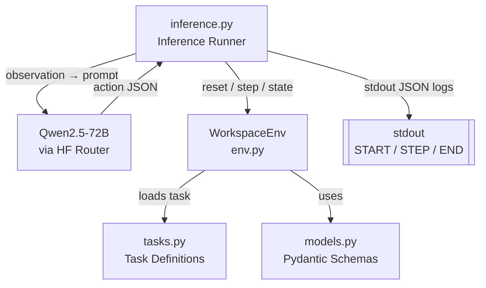

# Design Document: Workspace Organizer

## Overview

The Workspace Organizer is a fully in-memory AI agent benchmark environment modeled after the OpenEnv specification. It simulates a messy "Downloads" folder and challenges an AI agent to organize it through a sequence of file operations. There is no real disk I/O — all state lives in Python objects.

The system has two main runtime concerns:

1. **Environment** (`env/`): Manages simulated file system state, validates actions, and computes rewards.
2. **Inference Runner** (`inference.py`): Drives the agent (Qwen/Qwen2.5-72B-Instruct via HF router) through a full episode and emits structured stdout logs.

Three tasks of increasing difficulty (EASY, MEDIUM, HARD) are defined in `tasks.py`. Each task has a fixed initial state and a known solution used for reward grading.

---

## Architecture



The inference runner is the top-level orchestrator. It calls `env.reset(task_name)` to get the initial observation, formats it into a prompt for the agent, parses the agent's JSON response into an `Action`, calls `env.step(action)`, and repeats until `done=True` or a step budget is exhausted.

---

## Components and Interfaces

### `env/models.py` — Pydantic Schemas

All data exchanged between components is typed via Pydantic v2 models.

```python
class File(BaseModel):
    id: str
    name: str
    type: str        # e.g. "image", "document", "archive"
    date: str        # ISO 8601 date string
    summary: str     # short description used for duplicate detection
    size: int        # bytes, used for duplicate detection

class Action(BaseModel):
    action_type: str   # "rename" | "move" | "create_folder" | "delete"
    file_id: str | None = None
    target: str | None = None

class Observation(BaseModel):
    files: list[File]
    folders: dict[str, list[str]]   # folder_name -> [file_id, ...]
    instruction: str

class Reward(BaseModel):
    score: float
    message: str | None = None

class StepResult(BaseModel):
    observation: Observation
    reward: Reward
    done: bool
    info: dict
```

### `env/tasks.py` — Task Definitions

Each task is a dataclass (or TypedDict) holding:
- `name`: `"easy"` | `"medium"` | `"hard"`
- `instruction`: natural language string
- `initial_files`: `list[File]`
- `initial_folders`: `dict[str, list[str]]`
- `solution`: a `TaskSolution` describing expected renames, folder placements, and deletions

```python
class TaskSolution(BaseModel):
    expected_renames: dict[str, str]      # file_id -> expected name
    expected_placements: dict[str, str]   # file_id -> expected folder
    expected_deletions: set[str]          # file_ids to delete
```

Three task instances are registered in a `TASKS: dict[str, Task]` registry keyed by lowercase name.

### `env/env.py` — WorkspaceEnv

The central environment class. Holds mutable state and exposes the OpenEnv API.

```python
class WorkspaceEnv:
    def reset(self, task_name: str) -> Observation: ...
    def step(self, action: Action) -> StepResult: ...
    def state(self) -> Observation: ...
```

Internal state:
- `_files: dict[str, File]` — live file registry keyed by `file_id`
- `_folders: dict[str, list[str]]` — current folder structure
- `_solution: TaskSolution` — grading reference (immutable after reset)
- `_step_rewards: list[float]` — accumulated per-step scores for episode normalization
- `_done: bool`

### `inference.py` — Inference Runner

Drives a single episode end-to-end:

1. Parses CLI args for `--task` (default: `"easy"`)
2. Calls `env.reset(task_name)` → emits `[START]` JSON log
3. Loop: formats observation as prompt → calls HF router → parses `Action` → calls `env.step()` → emits `[STEP]` JSON log
4. On `done=True` or step budget exceeded → emits `[END]` JSON log with final score

Agent calls use the `openai` Python client pointed at the HF inference router endpoint.

---

## Data Models

### File

| Field | Type | Notes |
|---|---|---|
| `id` | `str` | Stable unique identifier (e.g. `"f001"`) |
| `name` | `str` | Current file name including extension |
| `type` | `str` | Semantic type: `"image"`, `"document"`, `"archive"`, etc. |
| `date` | `str` | ISO 8601 date (e.g. `"2024-03-15"`) |
| `summary` | `str` | Short description; used with `size` for duplicate detection |
| `size` | `int` | File size in bytes; used with `summary` for duplicate detection |

Two files are **duplicates** iff `file_a.summary == file_b.summary and file_a.size == file_b.size`.

### Action

| Field | Type | Required for |
|---|---|---|
| `action_type` | `str` | All actions |
| `file_id` | `str \| None` | `rename`, `move`, `delete` |
| `target` | `str \| None` | `rename` (new name), `move` (folder name), `create_folder` (folder name) |

### Reward Computation

Per-step contributions:

| Condition | Delta |
|---|---|
| Rename matches solution | `+0.3` |
| Move matches solution placement | `+0.4` |
| Delete matches expected duplicate deletion | `+0.5` |
| Invalid action (bad type, missing fields) | `−0.2` |
| Rename with empty/absent target | `−0.2` |
| Create folder with duplicate name or empty target | `−0.2` |
| Move to same folder (already there) | `−0.2` |
| Delete non-duplicate or unexpected deletion | `−0.5` |
| Reference to non-existent file_id or folder | `−0.2` |

Per-step score is clamped to `[0.0, 1.0]`. Episode score = sum of per-step rewards, normalized to `[0.0, 1.0]`.

### Task Sizing

| Task | Min Files | Special Requirements |
|---|---|---|
| EASY | 5 | Rename-only solution |
| MEDIUM | 10 | Folder creation + move solution |
| HARD | 12 | Folder organization + ≥2 duplicate pairs to delete |

### Log Line Schema

Each stdout log line is a single-line JSON object:

```json
// [START]
{"event": "START", "task": "hard", "observation": {...}}

// [STEP]
{"event": "STEP", "step": 3, "action": {...}, "reward": 0.4, "done": false}

// [END]
{"event": "END", "episode_score": 0.87}
```

---

## Correctness Properties

*A property is a characteristic or behavior that should hold true across all valid executions of a system — essentially, a formal statement about what the system should do. Properties serve as the bridge between human-readable specifications and machine-verifiable correctness guarantees.*


### Property 1: Invalid reference rejection

*For any* action that references a `file_id` or folder name not present in the current environment state, the environment SHALL return a negative reward and leave the state unchanged.

**Validates: Requirements 1.4, 1.5**

### Property 2: Reset produces clean state

*For any* sequence of actions applied to an episode, calling `reset(task_name)` afterward SHALL produce an `Observation` identical to calling `reset(task_name)` on a fresh environment with no prior actions.

**Validates: Requirements 2.5**

### Property 3: state() is read-only and idempotent

*For any* environment state, calling `state()` any number of times SHALL return equivalent `Observation` values and SHALL NOT modify the internal state.

**Validates: Requirements 2.3**

### Property 4: step() always returns a StepResult

*For any* `Action` value (valid or invalid), calling `step(action)` SHALL return a `StepResult` containing `observation`, `reward`, `done`, and `info` fields.

**Validates: Requirements 2.2**

### Property 5: Rename updates file name

*For any* valid `file_id` and any non-empty `target` string, after a `rename` action, the file's `name` field in the environment state SHALL equal `target`.

**Validates: Requirements 3.1**

### Property 6: Empty or absent target is always invalid

*For any* action of type `rename` or `create_folder` where `target` is empty or `None`, the environment SHALL return a reward of `−0.2` and leave the state unchanged.

**Validates: Requirements 3.3, 4.3**

### Property 7: create_folder adds a new empty folder

*For any* non-empty folder name that does not already exist in the current state, a `create_folder` action SHALL add that folder to the folder structure with an empty file list.

**Validates: Requirements 4.1**

### Property 8: Duplicate folder creation is rejected

*For any* folder name that already exists in the current state, a `create_folder` action SHALL return a reward of `−0.2` and leave the state unchanged.

**Validates: Requirements 4.2**

### Property 9: Move updates folder membership

*For any* valid `file_id` in folder A and any valid target folder B where A ≠ B, after a `move` action, the `file_id` SHALL appear in folder B and SHALL NOT appear in folder A.

**Validates: Requirements 5.1**

### Property 10: Move to same folder is rejected

*For any* `file_id` already in folder F, a `move` action targeting folder F SHALL return a reward of `−0.2` and leave the state unchanged.

**Validates: Requirements 5.3**

### Property 11: Delete removes file from all state

*For any* valid `file_id`, after a `delete` action, the `file_id` SHALL NOT appear in any folder's file list and SHALL NOT appear in the environment's file registry.

**Validates: Requirements 6.1**

### Property 12: Unexpected deletion is penalized

*For any* `file_id` that is not in the task solution's `expected_deletions` set, a `delete` action SHALL return a reward of `−0.5`.

**Validates: Requirements 6.3**

### Property 13: Per-step reward is bounded

*For any* action, the `reward.score` returned by `step()` SHALL be in the range `[0.0, 1.0]`.

**Validates: Requirements 7.2**

### Property 14: Episode score is bounded and deterministic

*For any* sequence of actions on any task, the episode score SHALL be in `[0.0, 1.0]`, and running the same action sequence on the same task twice SHALL produce identical per-step rewards and the same final episode score.

**Validates: Requirements 7.3, 7.4**

### Property 15: Invalid action type returns penalty without termination

*For any* unrecognized `action_type` string, `step()` SHALL return a reward of `−0.2` and `done=False`.

**Validates: Requirements 7.5**

### Property 16: Log lines are valid single-line JSON

*For any* episode run, every line emitted to stdout by the inference runner SHALL be parseable as a JSON object and SHALL contain no embedded newline characters.

**Validates: Requirements 10.2, 10.6**

---

## Error Handling

### Invalid Actions

All invalid action conditions return a `Reward` with a negative score and `done=False`. The environment never raises an exception for invalid agent actions — it always returns a `StepResult`. This ensures the inference runner can continue the episode after agent mistakes.

| Condition | Behavior |
|---|---|
| Unrecognized `action_type` | `−0.2` penalty, state unchanged |
| Missing required field (`file_id` or `target`) | `−0.2` penalty, state unchanged |
| Non-existent `file_id` | `−0.2` penalty, state unchanged |
| Non-existent target folder | `−0.2` penalty, state unchanged |
| Duplicate folder name | `−0.2` penalty, state unchanged |
| Move to same folder | `−0.2` penalty, state unchanged |
| Delete non-duplicate / unexpected | `−0.5` penalty, file is still removed |

### Agent Response Parsing

The inference runner wraps agent response parsing in a try/except. If the agent returns malformed JSON or a response that cannot be coerced into an `Action`, the runner constructs a synthetic invalid `Action` (e.g., `action_type="parse_error"`) and passes it to `env.step()`, which applies the `−0.2` penalty. This prevents the runner from crashing on bad agent output.

### Step Budget

The inference runner enforces a maximum step count (e.g., 50 steps) to prevent infinite loops. When the budget is exhausted, the runner emits `[END]` with the accumulated score and exits.

### Environment Initialization

If `reset()` is called with an unknown `task_name`, the environment raises a `ValueError` immediately (before any episode state is set). This is a programmer error, not an agent error, so it is appropriate to raise rather than return a penalty.

---

## Testing Strategy

### Dual Testing Approach

Unit tests cover specific examples, edge cases, and error conditions. Property-based tests verify universal invariants across many generated inputs. Both are needed for comprehensive coverage.

### Property-Based Testing

**Library**: [`hypothesis`](https://hypothesis.readthedocs.io/) (Python)

Each correctness property maps to a single `@given`-decorated test. Tests run a minimum of 100 iterations (configured via `settings(max_examples=100)`). Each test is tagged with a comment referencing the design property.

Tag format: `# Feature: workspace-organizer, Property {N}: {property_text}`

**Generators needed**:
- `st.sampled_from(["easy", "medium", "hard"])` — task names
- `st.text(min_size=1)` — non-empty strings for targets/names
- `st.text()` — arbitrary strings including empty
- `st.uuids().map(str)` — random file IDs (likely non-existent)
- Custom `st.builds(Action, ...)` composites for each action type

### Unit Tests

Focus on:
- Correct reward values for solution-matching actions (Properties 3.2, 5.2, 6.2 — EXAMPLE classification)
- Task loading: verify file counts and solution structure for EASY/MEDIUM/HARD
- `reset()` returns correct initial observation for each task name
- `[START]` and `[END]` log line format
- Agent response parsing error handling
- `openenv.yaml` parses as valid YAML with required fields

### Integration Tests

- Mock the HF router; verify the inference runner calls it once per step with the current observation
- Run a full episode with a scripted agent (deterministic action sequence) and verify the final `[END]` log score

### Test File Layout

```
tests/
├── test_env.py          # unit + property tests for WorkspaceEnv
├── test_models.py       # Pydantic schema validation tests
├── test_tasks.py        # task definition smoke tests
└── test_inference.py    # inference runner unit + integration tests
```
